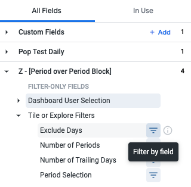
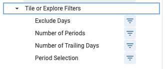
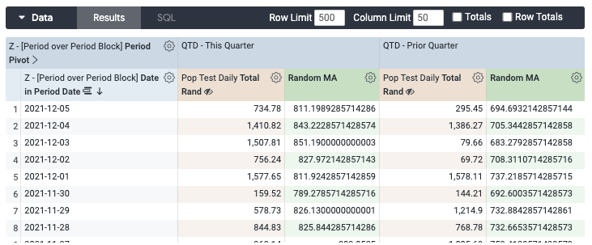
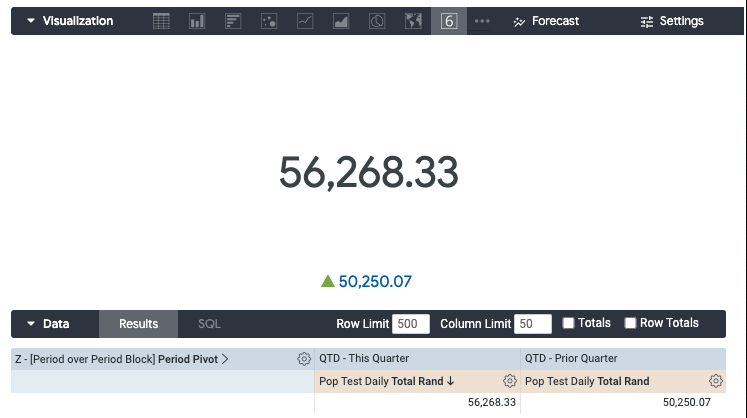
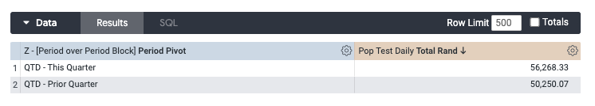

# A Period Over Period Block for Looker

## Features
This block allows for a number of period over period type comparisons, both at the tile level, and for a full dashboard.

### Comparison Options
* Trailing period over period. Example: Last 7 days vs the prior 7 days before that. You must set the
* Trailing 30, 90, 180, and 365 - A trailing period over period
* Trailing 30, 90, 180 vs Last Year
* Month to Date (MTD) vs prior month.
* MTD vs prior quarter.
* MTD vs prior year.
* Quarter to Date (QTD) vs prior quarter.
* QTD vs Prior Year.
* Year to Date (YTD) vs prior year.
* Last completed month vs the month before. For example, if we are in the middle of May, this would compare April to March.
* Last completed quarter vs the quarter before.
* Last completed year vs the year before.

### Start Date Filter Options
Start date filters can be used separately from the PoP block. This can be useful if your data isn't realtime.
* **Exclude the current day.** Useful when data is pulled nightly, or you don't want to show an incomplete day.
* **Exclude yesterday.** Moves the start date back two days.
* **Exclude to last data.** This will automatically find the max date where data exists and start the comparison there.
* **Exclude to end of prior week.** Only shows data through the end of the last fully completed week.
* **Exclude to end of prior month.**
* **Exclude to end of prior quarter.**
* **Exclude to end of prior year.**

## Usage

### Manifest File
To use the PoP block, you must first import the project. Adding the following code to your `manifest.ikml` file will import the current master branch.

    remote_dependency: pop_block {
        url: "https://github.com/Cold-Bore-Capital/looker_pop_block"
        ref: "master"
     }
Given the development maturity of the project, using a git commit hash is likely a lot safer than using master. Breaking changes may cause problems in the master branch. Looker is supposed to allow the use of a tag in `ref`, but this feature appears broken. Tags for each release are still provided.

#### Constants Override
Currently, there is only one option set by constant during import, the name of the project. The project name changes how the project displays in the field list. Currently, this is set to `Z - PoP Block` so that it will sort at the bottom of the field list. You can change this by overriding the constant.

    remote_dependency: pop_block {
        url: "https://github.com/Cold-Bore-Capital/looker_pop_block"
        ref: "master"
        override_constant: block_field_name {
            value: "New Name for Project in Field List"
          }
     }

### Model
The PoP block uses the `sql_always_where` attribute of the explore to inject the necessary filters. The name of the view must be added to the top four variables.

In this example, you would replace `pop_test_daily` with the name of your view.

    explore: pop_test_daily {

      sql_always_where:
      
      
      
      
      
        
          
            (${event_date} between ${period_1_start} and ${period_1_end})
          
            ((${event_date} between ${period_1_start} and ${period_1_end})
            or (${event_date} between ${period_2_start} and ${period_2_end}))
          
            ((${event_date} between ${period_1_start} and ${period_1_end})
            or (${event_date} between ${period_2_start} and ${period_2_end})
            or (${event_date} between ${period_3_start} and ${period_3_end}))
          
            ((${event_date} between ${period_1_start} and ${period_1_end})
            or (${event_date} between ${period_2_start} and ${period_2_end})
            or (${event_date} between ${period_3_start} and ${period_3_end})
            or (${event_date} between ${period_4_start} and ${period_4_end}))
        
      
        -- PoP Block is not in use. Default to 1=1 to avoid errors.
        1 = 1
      
      ;;
    }

### View

Within the view the project must be imported.

    include: "//pop_block/pop_block.view"

Several special fields must be set within the view. This is example is from a PDT. While the PoP block can be used with any view, it was specifically designed with PDTs in mind as they are a far better way to do business.

    #----------- START POP BLOCK -----------
    extends: [pop_block, completed_time_block_filter]

    # The event date must be set to whatever main time series dimension_group is in use by the view.
    # It's very important to set convert_tz to no if you have only a date with no time value.
    dimension: event_date {
      sql: ${TABLE}.completed_date ;;
      type: date
      hidden: yes
      # Turn this to no if your table is pulling just a date. Yes if table is pulling a datetime type.
      convert_tz: no
    }

    # This field can be set to simply ${TABLE}. The table_name field is used
    dimension: table_name {
      type: string
      sql: ${TABLE} ;;
      hidden: yes
    }

    # This field is needed for the "last data" filter to function properly from within a PDT. The "last data" filter option
    # uses this sql call to find the date with the last data `select max(${origin_event_date}) from ${origin_table_name}`
    dimension: origin_event_date {
      sql: completed_date ;;
      type: string
      hidden: no
    }

    # This field is also required for last data from within a PDT. The PDT is unaware of the main table name to search
    # for last data, so this field must be used.
    dimension: origin_table_name {
      type: string
      sql: ps.transactions;;
      hidden: no
    }
    #------------ END POP BLOCK ------------

## Usage

Important note, when using the PoP block, it's important to use the time series from within the PoP block instead of the native time series from the view.

Once joined in the view, the PoP block will add a section named *to the fields list of any tile or explore.

### Usage in Tile or Explore

#### Step 1: Set Filters
To use the PoP block in a tile or explore, add all four filters under the `Filters - Tile or Explore` section. At a minimum you need to set an option for the `Period Selection`, and `Number of Periods` filters.

#### Step 2: Set Period Pivot or Use Period as X-Axis

You can either pivot on the `Period Pivot` field, or add it as an X Axis for use is something like a single value tile with "Compare to" feature turned on.

In this example the `Period Pivot` field is used as a pivot. 

To create single value cards with change, use the pivot option. 

In this example, the field is used as an X Axis dimension. 

#### Step 3: Set X-Axis (if not selected in step 2)

There are two options for the X Axis:

1. Select one of the time range values from `Date in Period` such as `Date in Period Date` to display some grouping level of dates. 
2. Select `Day in Period` for a relative 1, 2, 3, 4 style X Axis. 

### Usage in Dashboards 
The PoP block can be used to filter an entire dashboard. Filters added at the dashboard level take priority over filters set at the tile level. If no filter is set at the dashboard level for an option, the filters set in the tile will take precedence.

#### Filtering Non-PoP Tiles.
In addition to setting period over period options on a dashboard level, it will also filter any non PoP charts to the limit of Period 1's range. 

The `Exclude Days` filter will also function on non-PoP charts and can be used independently of any other option or filter.

