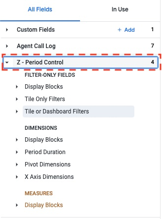
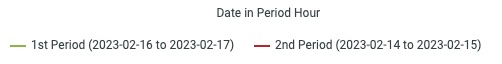

# Looker Period Control Block
This is a Looker block that allows you to control the period of time that is being displayed in a dashboard along with period comparison. This block is designed to replace all other forms of date control on a dashboard giving users the option to filter regular tiles, and tiles with period comparison requirements all in a single control.

Unlink many existing period over period blocks for Looker, the Looker Period Control block relies heavily on LookML. This shifts processing to Looker instead of the database, and allows the system to generate SQL that's easy to read and debug.

## Demo Video
[Demo Video (YouTube)](https://youtu.be/u5Dv320JH-s)

[Training Videos Playlist (YouTube)](https://youtube.com/playlist?list=PLXv5JOXwwDwFJVN1tnr6aPxz-sZB6o_6T)

## Key Features
* Control the period of time for a dashboard or tile via a simple dropdown.
* Allow for easy period selection including:
    * Trailing days
    * Period selection of trailing X days, and pre-set ranges like current week, last month, etc.
    * Comparison to a trailing period, last full week, month, quarter, year, etc.
* Allow for comparison of up to 53 periods in a single chart.
* Easy integration and deployment.
* Generates readable SQL for easy debugging.
* Set an "As Of" date. This allows a user to pick a date other than today, while still selecting a value such as "trailing 90 days".
* Easily filter the end date of a tile to:
  * Yesterday
  * Two Days Ago
  * End of Last Full Week, Month, Quarter, Year


## Installation
To use the Looker Period Control Block, you will need to add the external package to your manifest file, add a short bit of code to your model, then add several dimensions to your view along with an include.

### Install Tutorial
[Install Tutorial Video](https://www.youtube.com/watch?v=g5OFwroZ5r4)

### Manifest File
Add the following code to your manifest file. This will allow you to use the block in your project via a `include:`.
```yaml
remote_dependency: looker_period_control {
  url: "https://github.com/Cold-Bore-Capital/looker_period_control"
  # Find the latest tag hash here https://github.com/Cold-Bore-Capital/looker_period_control/tags
  ref: "v1.1.7"
}
```


#### Manifest File Options
There are several options that can be set in the manifest file. These are optional (with the possible exception of `database_type`), and are not required to use the block. You can set the value of a constant within the `remote_dependency` block.

Example: Set the database type to BigQuery

```yaml
remote_dependency: looker_period_control {
  url: "https://github.com/Cold-Bore-Capital/looker_period_control.git"
  # Find the latest tag hash here https://github.com/Cold-Bore-Capital/looker_period_control/tags
  ref: "v1.1.7"
  override_constant: database_type {
    value: "bigquery"
  }
}
```

##### Override Options List
* `database_type` - Defaults to `redshift`. This is used to generate the correct SQL for the database you are using. Options are:
  * `redshift`
  * `bigquery`
  * `snowflake`
* `period_control_group_title` - This will control how the dimensions and measures related to the Looker Period Control block group in your explore. By default, the value is set to "Z - Period Control."

   

* `date_display_formt` - Set format for dates. Defaults to `YYYY-MM-DD`. Any format supported by your database. Do not enter time here, that is controlled by the `time_display_format` constant.
* `time_display_format` - Set format for time. Defaults to `HH:MI`. Any format supported by your database.
* `database_time_zone` - Set the time zone of your database. Defaults to `UTC`. This is used to convert the date to the correct time zone. Note, this has no effect for BigQuery where timestamps are allways UTC.
* `days_in_standard_month` - Set the number of days for a "Prior Month" type comparison. Defaults to 30. See section on Prior Month compare for more details.
* `days_in_standard_quarter` - Set the number of days for a "Prior Quarter" type comparison. Defaults to 91. See section on Prior Quarter compare for more details.

### Model Explore
Adding the looker_period_control block to your explore only takes a single line of code. Simply add `sql_always_where: ${sql_always_where_inject};;` to the explore block. This will allow the Looker Period Control block to inject the correct date filter into the explore.

```yaml
explore:  orders {
  sql_always_where: ${sql_always_where_inject};;
}
```

### View
At the top of the view file, place the following code to include the block.

```yaml
include: "//looker_period_control/main.view"
```

Copy and paste the following template into the file, updating the fields as specified. Note, it is best practice to set `hidden: yes` on any date fields within the view, or simply don't include the `dimension_group` for dates in the file. This will help prevent your users from accidentally filtering on, or selecting the wrong date dimension in a tile.

#### View Block Template
```yaml
#----------- Looker Period Control Block -----------
  extends: [main]


  dimension: event_date {
    sql: ${TABLE}.<replace_with_date_field>;;
    # Important. If this field only contains a date, with no time, this must be set to no. You will have major problems
    # if a date such as 2022-01-01 is converted to local time. Looker will think of this as 2022-01-01 00:00:00 and in the case
    # of a -5 conversion, would turn that into 2021-12-31 19:00:00.
    convert_tz: no

    # --- Do Not Edit Below this Line ----
    type: date_raw
    hidden: yes
    # --- End No Not Edit block       ----

  }

  parameter: convert_tz {
    # Instructions: If your date is just a date with no time, set this value to no. If your date is a date with time, set to yes. It is VERY important that you do
    # not set this value to yes if you only have a date. Bad things will happen.
    default_value: "no"

    # --- Do Not Edit Below this Line ----
    type: yesno
    hidden: yes
    # --- End No Not Edit block       ----
  }

  # Do not edit table_name. This should stay as is.
  dimension: table_name {
    # --- Do Not Edit Below this Line ----
    type: string
    sql: ${TABLE};;
    hidden: yes
    # --- End No Not Edit block       ----
  }

  # Origin event date and origin period name are required when using the "Last Data" filter option. The value here will be
  # used to create a (select max(date_field) from table) type query. This will be used to limit the date range to the max date.
  # When using a derived table, the query has no way to know what table name to query for last data. If using a derived table,
  # these values should be set to whatever source table contains the "max" date.

  dimension: origin_event_date {
    # Instructions: Replace with the name of the origin date column
    sql: <replace_with_date_field>;;
    # --- Do Not Edit Below this Line ----
    type: string
    hidden: yes
    # --- End No Not Edit block       ----
  }

  dimension: origin_table_name {
    # Instructions: The origin_table_name dimension allows for the use of "Last Data" filter option. If you are
    # using a PDT, you must hand enter the schema and table name of whatever table contains the date dimension.
    # For example, if you had a PDT that mostly derived from shop.orders, you would enter that. If using a
    # standard SQL table, you can enter the name of the view and SQL_TABLE_NAME. For example ${my_view.
    # SQL_TABLE_NAME}.
    sql: ${<replace_with_view_name>.SQL_TABLE_NAME} OR <replace with origin schema and table>;;
    # --- Do Not Edit Below this Line ----
    type: string
    hidden: yes
    # --- End No Not Edit block       ----
  }

  #------------ End Looker Period Control Block ------------
  ```

#### View Block Example
```yaml
#----------- Looker Period Control Block -----------
  extends: [main]


  dimension: event_date {
    sql: ${TABLE}.order_date;;
    # Important. If this field only contains a date, with no time, this must be set to no. You will have major problems
    # if a date such as 2022-01-01 is converted to local time. Looker will think of this as 2022-01-01 00:00:00 and in the case
    # of a -5 conversion, would turn that into 2021-12-31 19:00:00.
    convert_tz: no

    # --- Do Not Edit Below this Line ----
    type: date_raw
    hidden: yes
    # --- End No Not Edit block       ----

  }

  parameter: convert_tz {
    # Instructions: If your date is just a date with no time, set this value to no. If your date is a date with time, set to yes. It is VERY important that you do
    # not set this value to yes if you only have a date. Bad things will happen.
    default_value: "no"

    # --- Do Not Edit Below this Line ----
    type: yesno
    hidden: no
    # --- End No Not Edit block       ----
  }

  # Do not edit table_name. This should stay as is.
  dimension: table_name {
    # --- Do Not Edit Below this Line ----
    type: string
    sql: ${TABLE};;
    hidden: yes
    # --- End No Not Edit block       ----
  }

  # Origin event date and origin period name are required when using the "Last Data" filter option. The value here will be
  # used to create a (select max(date_field) from table) type query. This will be used to limit the date range to the max date.
  # When using a derived table, the query has no way to know what table name to query for last data. If using a derived table,
  # these values should be set to whatever source table contains the "max" date.

  dimension: origin_event_date {
    # Instructions: Replace with the name of the origin date column
    sql: order_date;;
    # --- Do Not Edit Below this Line ----
    type: string
    hidden: yes
    # --- End No Not Edit block       ----
  }

  dimension: origin_table_name {
    # Instructions: The origin_table_name dimension allows for the use of "Last Data" filter option. If you are
    # using a PDT, you must hand enter the schema and table name of whatever table contains the date dimension.
    # For example, if you had a PDT that mostly derived from shop.orders, you would enter that. If using a
    # standard SQL table, you can enter the name of the view and SQL_TABLE_NAME. For example ${my_view.
    # SQL_TABLE_NAME}.
    sql: ${my_view.SQL_TABLE_NAME};;
    # --- Do Not Edit Below this Line ----
    type: string
    hidden: yes
    # --- End No Not Edit block       ----
  }

  #------------ End Looker Period Control Block ------------
  ```

## Usage

### Basic Usage
Note that on a dashboard, tiles can be used in both modes. You would just set the PoP filters to only affect tiles where a PoP is desired. The `Period Selection` filter can then be used to control the period for both the PoP and non-PoP tiles.

#### Period Selection Mode (No Period over Period)
For period selection mode, you will need to add the `Period Selection` filter, along with the `Number of Trailing Days` filter. It may be a good idea to include the `Snap Start Date to` filter as well if you want to ensure that your range contains a full week, month, quarter, or year. You should not have a `Compare to` filter in this mode.

Add a value from the `X Axis Dimensions` group to your X-Axis, add a measure, and run.

#### Period over Period (PoP) Mode
The minimum setup for a PoP tile includes the `Period Selection`, `Number of Trailing Days`, `Compare to`, and `Number of Periods` filters. You will need to pivot on the `Pivot Dimensions/Period` dimension, add a value from the `X Axis Dimensions` group to your X-Axis, add a measure, and run.

### Filters

#### Tile Only Filters
Tile only filters are designed to be used within a single tile, not on a dashboard.

##### Debug Mode (Yes / No)

Debug mode will place a block of SQL comment code into the rendered SQL with information about the current filter state. It should not be necassary unless you are activly developing for the period control block. The block will look like this

```sql
-- *****************************************
-- As of Value:       NULL
-- Period Selection:  trailing
-- Exclude Value:     999
-- Snap Start Date:   none
-- Compare to Period: prior_month
-- Range Size:        2
-- Additional Days:   0
-- Range Start:       2
-- Range End:         0
-- Convert TZ:        true
-- *****************************************
```

##### Display Dates in Period Labels
This filter turns on date display in your axis labels. You can control if time is displayed using the `Show Time in Date Display` filter.

Example with time displayed


Example without time displayed



##### Number of Periods
This value sets the number of periods that will display when pivoted on the `Pivot Dimensions/Period` dimension. You can select up to 53 periods, however performance issues may occur with higher period selections.

##### Snap Start Date To (Non PoP Tiles Only)
The `Snap Start Date To` filter solves a problem with display of partial ranges when the X-Axis is set to a week, month, quarter, or year. For example, if you have a chart that displays revenue by week, the user will expect that the first week in the chart is a full week. If the period selection is trailing 90 days, it is very likely that the first column will only contain partial data. The `Snap Start Date to` filter will ensure that the first week, month, quarter, or year in the chart is a full week of data.

Very bad things will happen if you try to use this filter with a PoP tile. Do not do it.

#### Tile or Dashboard Filters
Filters in this section can be added directly to Tiles or Looks, and to Dashboards. Note that a filter in a dashboard will always override a filter in a tile.

##### As Of Date
The `As Of Date` filter allows you to select a specific date to use as the end of the period. This is useful if you want to compare a specific date to a prior period. For example, if you wanted to compare a week at the end of last month, you could set your `As Of Date` to the last day of the month. The tiles or dashboard will now behave as if today is whatever date you selected.

##### Compare To
The `Compare To` filter allows you to select a period to compare the current period to. For example, if you have a tile that displays revenue by week, you can select `Prior Week` to compare the current week to last week. Options exist for trailing, prior week, month, quarter, or year.

**Important Note about Month and Quarter "Compare To":** Because each month and quarter can have a different number of days, month and quarter comparisons are standardized to a set number of days set by the `days_in_standard_month` and `days_in_standard_quarter` constants. By default, these are set to 30 days for month, and 91 days for a quarter.

##### Exclude Days
Exclude days allows you to start your data from a specific point. Option are:
* Today. This will exclude the current day.
* Yesterday. This will exclude the current day and yesterday.
* End of Last Full Week, Month, Quarter, or Year
* Last Data. Last data will run a `select max(date_field) from table` query to determine the last date in the table. This can be very useful if your data loads intermittently. Make sure your `origin_event_date` and `origin_table_name` dimensions are set correctly during configuration.

##### Number of Trailing Days
The `Number of Trailing Days` filter allows you to select the number of days to display in your chart. Options are pre-set to common intervals. This will only be used when `Period Selection` is set to `Trailing`.

##### Period Selection
The `Period Selection` filter allows you to select the period to display or trailing to display a trailing period.

#### Display Block Dimensions
These dimensions are intended to be used in a "Single Value" type tile. They are designed to display information to the user about the current filter state or errors on a dashboard.

##### Display Block
With Looker, there is no way to prevent users from selecting invalid parameter / filter states. For example, if you selected `Month to Date` for your `Period Selection`, and `Prior Week` for your `Compare To` filter, you will get incorrect results. This block can be added to a dashboard to display errors to the user.

Note, errors are integrated into the `First Period Date Range` dimension as well. There is no need to include both.

##### First Period Date Range
The `First Period Date Range` dimension is used to display the date range for the first period in the chart. This block can be added to dashboards to show the users what date range is being displayed. If an invalid filter selection combination is made, this dimension will display an error message explaining the problem. This dimension is best used in a "Single Value" type tile.

#### Period Duration Dimensions
The values in this section show the days, minutes, or seconds in a period. The main utility of these dimension is for run-rate calculations. For example, users want to know what the run rate for the year would be if the total from the current selected period was extrapolated for the entire year. You could create a table calculation like `${orders.revenue} * (365 / ${orders.period_1_len})`.

#### Pivot Dimensions -> Period
This dimension allows for the period over period comparison. Normally, you would pivot on this dimension, however it can be used on an X-Axis as well. This is required for any PoP tiles.

#### X Axis Dimensions
This should be the only date series used in a chart. While not strictly used on the X Axis, these dimensions will most commonly be added to your X-Axis to create your dates. It is best practice to either remove, or set any other `dimension_group` within your file to `hidden` so that users don't accidentally use the wrong time series. Use of another time series will not filter based on the `Period Selection` filter.
